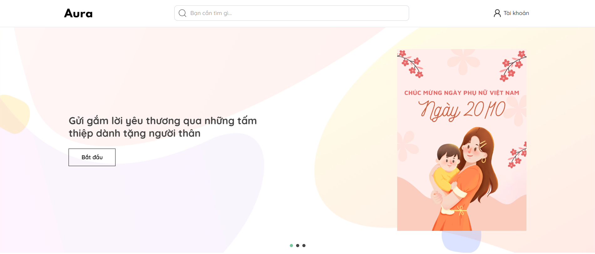
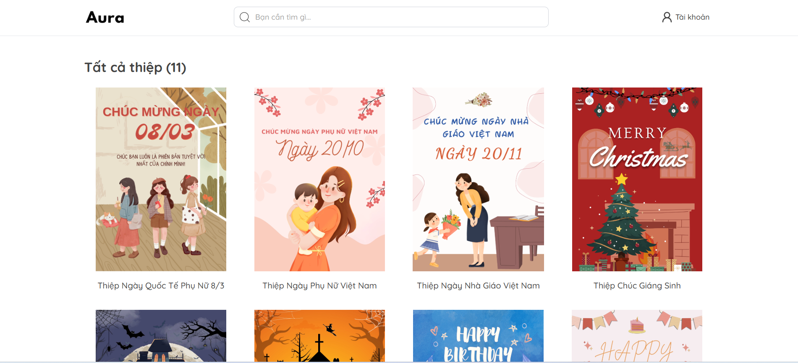

# WEBSITE THỜI TRANG





## Cài đặt môi trường

**1. Clone repository**

```
https://github.com/lamquang4/aura-web-modern.git
```

**2. Chạy website bằng Docker**

```
docker compose up --build
```

## Công nghệ sử dụng

| Danh mục   | Tools / Frameworks                                                                                                                                           |
| ---------- | ------------------------------------------------------------------------------------------------------------------------------------------------------------ |
| Frontend   | Vite + TypeScript + React 19 <br> TailwindCSS <br> @react-oauth/google + jwt-decode + js-cookie <br> Axios + TanStack Query v5 <br> Redux <br> Framer-motion |
| Backend    | Spring Boot + Maven + Java 17 <br> Spring Security + JWT + OAuth2                                                                                            |
| Database   | MongoDB                                                                                                                                                      |
| Storage    | Cloudinary                                                                                                                                                   |
| Monitoring | Actuator + Prometheus + Zipkin                                                                                                                               |
| CI/CD      | GitHub Actions                                                                                                                                               |
| Deployment | Render Fullstack                                                                                                                                             |
