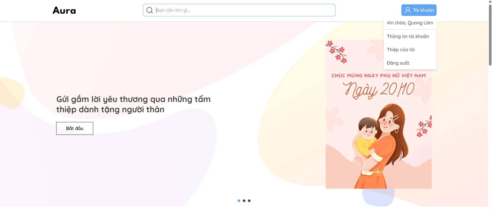
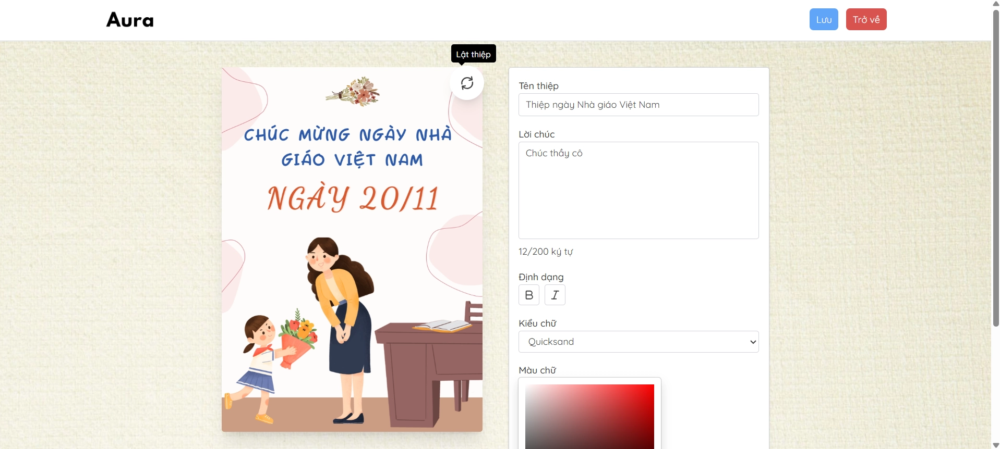

# WEBSITE THIỆP CHÚC ĐIỆN TỬ

Website thiệp chúc điện tử, cho phép người dùng lựa chọn các mẫu thiệp có sẵn theo từng dịp, tùy chỉnh lời chúc, font chữ và màu chữ, sau đó tạo liên kết để gửi thiệp đến bạn bè, người thân hoặc người yêu.

Người nhận có thể truy cập liên kết và mở phong bì điện tử để xem thiệp cùng lời chúc được cá nhân hóa.

Hệ thống cũng cung cấp trang quản trị để quản lý mẫu thiệp và tài khoản người dùng với cơ chế phân quyền theo vai trò.





**Live demo**

Website: [](https://aura-web-modern.onrender.com)

Admin: [](https://aura-web-modern.onrender.com/admin/login)

**Viết lời chúc vào thiệp**

[Xem video demo](https://quanglam.vercel.app/assets/projects/project4/video1.mp4)

**Gửi thiệp chúc cho người thân**

[Xem video demo](https://quanglam.vercel.app/assets/projects/project4/video2.mp4)

## Cài đặt môi trường

**1. Clone repository**

```
git clone https://github.com/lamquang4/aura-web-modern.git
```

**2. Chạy website bằng Docker**

```
docker compose up --build
```

## Công nghệ sử dụng

| Danh mục   | Tools / Frameworks                                                                                                                                                                      |
| ---------- | --------------------------------------------------------------------------------------------------------------------------------------------------------------------------------------- |
| Frontend   | Vite + TypeScript + React 19 <br> TailwindCSS <br> Zod + React Hook Form <br> @react-oauth/google + jwt-decode + js-cookie <br> Axios + TanStack Query v5 <br> Redux <br> Framer-motion |
| Backend    | Spring Boot + Maven + Java 17 <br> Spring Security + JWT + OAuth2                                                                                                                       |
| Database   | MongoDB                                                                                                                                                                                 |
| Storage    | Cloudinary                                                                                                                                                                              |
| Monitoring | Actuator + Prometheus + Zipkin                                                                                                                                                          |
| Deployment | Frontend + Backend on Render                                                                                                                                                            |

## Chức năng chính

**1. Quản lý thiệp:** Cho phép quản trị viên tạo, chỉnh sửa và xóa các mẫu thiệp trên hệ thống.

**2. Quản lý thiệp tùy chỉnh:** Cho phép người dùng đã đăng nhập lựa chọn mẫu thiệp có sẵn, cá nhân hóa lời chúc với font chữ và màu chữ tùy chỉnh, đồng thời lưu lại thiệp đã tạo để sử dụng, chỉnh sửa hoặc xóa sau này.

**3. Gửi và nhận thiệp:** Cho phép người dùng tạo và chia sẻ liên kết thiệp đến người nhận. Người nhận có thể truy cập liên kết, mở phong bì điện tử và xem nội dung lời chúc được cá nhân hóa.

**4. Quản lý người dùng:** Cho phép quản trị viên quản lý tài khoản người dùng trên hệ thống.
